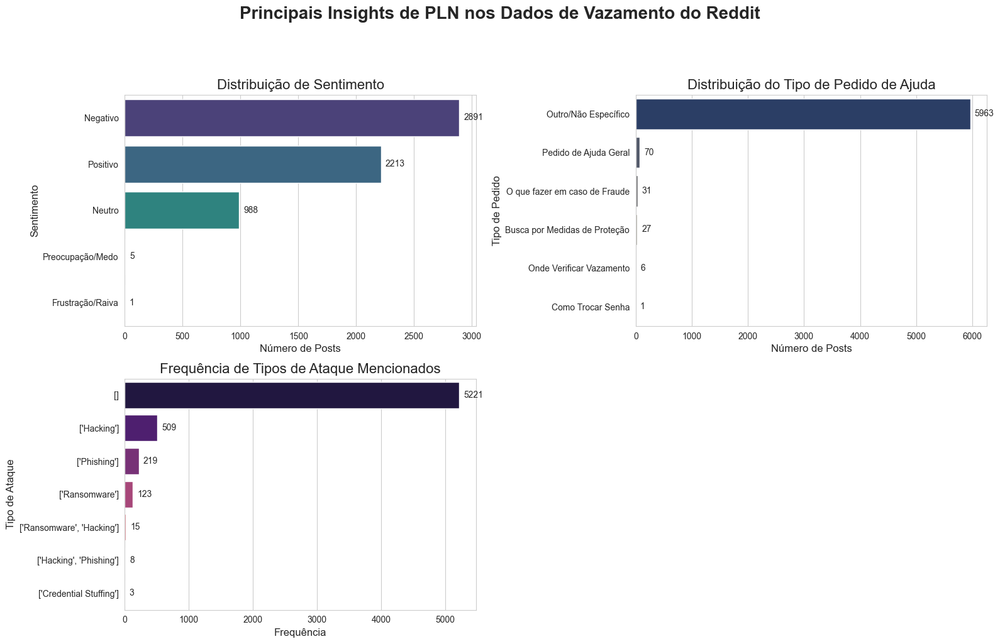

### **Análise de dados do Reddit sobre vazamentos de dados**
#### Inteligência Artificial e Identidade Auto Soberana: Defesa Contra Vazamentos de Dados
Autor: Carlos Eugênio Moreira de Santana <br>
Instituição: POLI USP Pró <br>
Orientador: Felipe Francisco Nusda <br>
Última Atualização: 28 de junho de 2025 <br>

### Processo de Enriquecimento e Análise de Dados do Reddit

Este Jupyter Notebook (JN) é um anexo técnico que documenta e executa o processo de enriquecimento e pré-análise de um conjunto de dados textuais extraído do fórum online Reddit. Este processo é parte integrante da metodologia de pesquisa do Trabalho de Conclusão de Curso (TCC) intitulado "Inteligência Artificial e Identidade Auto Soberana: Defesa Contra Vazamentos de Dados".

O objetivo principal deste notebook é demonstrar a aplicação de técnicas de Processamento de Linguagem Natural (PLN)** para transformar dados textuais não estruturados, obtidos de discussões públicas, em informações ricas e quantificáveis. A partir de posts e comentários sobre vazamentos de dados, realizaremos um pipeline de enriquecimento que inclui:

**Coleta de Dados (Demonstração)** <br>
Apresentação do método de extração de dados do Reddit via API, utilizando a biblioteca PRAW, para replicar o processo de coleta.

**Pré-processamento de Texto** <br>
Limpeza e normalização do conteúdo textual para prepará-lo para a análise.

**Análise de Sentimento e Classificação de Emoções** <br>
Avaliação do tom emocional das discussões, categorizando-o em estados como "Pânico", "Frustração", "Preocupação" e "Busca por Solução", indo além de uma simples polaridade (positivo/negativo).

**Classificação do Tipo de Pedido de Ajuda** <br>
Identificação e categorização da intenção do usuário, classificando suas solicitações de ajuda em categorias práticas (e.g., "Como Trocar Senha", "Onde Verificar Vazamento").

**Extração de Entidades Nomeadas (NER)** <br>
Identificação automática de entidades-chave, como organizações, tipos de ataques e dados pessoais mencionados nos posts.

Ao final deste processo, o conjunto de dados original será enriquecido com novas colunas que permitirão análises estatísticas e visuais aprofundadas. O notebook serve como um registro detalhado de cada etapa do pipeline, desde a origem dos dados até a preparação do arquivo final para a análise de resultados, conforme a estrutura do TCC.

**Execute as células em sequência para acompanhar cada etapa do processo e reproduzir os resultados.**


Ao final deste processo, o conjunto de dados original será enriquecido com novas colunas que permitirão análises estatísticas e visuais aprofundadas. O notebook serve como um registro detalhado de cada etapa do pipeline, desde a origem dos dados até a preparação do arquivo final para a análise de resultados, conforme a estrutura do TCC

**Para reproduzir os resultados execute as células em sequência para acompanhar cada etapa do processo.**

### Configuração do ambiente conda

Para garantir um ambiente de execução robusto, isolado e livre de conflitos de dependência, este projeto utiliza o **Conda**. O Conda é um gerenciador de pacotes e ambientes ideal para projetos de Ciência de Dados, pois lida de forma eficaz com as complexas dependências de bibliotecas como `numpy` e `scipy`.

Se você ainda não tem o Conda, instale o **Miniconda** ou o **Anaconda**.

**Comandos para criar e ativar o ambiente (execute no terminal, não no notebook)**

1.  **Criar o ambiente Conda**
    ```bash
    conda create --name tcc_analise python=3.9
    ```
    (Este comando cria um novo ambiente chamado `tcc_analise` com o Python 3.9)<p>

2.  **Ativar o ambiente**
    ```bash
    conda activate tcc_analise
    ```
    (Você verá o nome do ambiente `(tcc_analise)` aparecer no prompt do seu terminal)<p>

3.  **Desativar o ambiente**
    ```bash
    conda deactivate
    ```
    <p>
    
4. **Instalar o pacote do Jupyter Notebook**
    ```bash
    pip install notebook
    ```
    <p>

   
Após ativar o ambiente no terminal, retorne ao Jupyter Notebook e execute a próxima célula de código para instalar todas as bibliotecas necessárias.

### Instalação das Dependências

Antes de iniciar o processamento dos dados, é necessário instalar e importar as bibliotecas Python que compõem este pipeline. O comando `!pip install` é utilizado para instalar os pacotes diretamente no ambiente do Jupyter Notebook.


```python
# Instalação, Importação e Download de Recursos

# --- Instalação de Bibliotecas ---
print("--- Instalando bibliotecas. Isso pode levar alguns minutos... ---")
# O '!' permite executar comandos do terminal/shell dentro do Jupyter.
# Estamos usando 'pip' para instalar, mas o gerenciamento do ambiente é feito pelo Conda.
!pip install --upgrade pandas praw spacy nltk vaderSentiment matplotlib seaborn

# --- Importação de Módulos ---
print("\n--- Importando módulos... ---")
import pandas as pd
import re
import spacy
from nltk.corpus import stopwords
from nltk.tokenize import word_tokenize
from vaderSentiment.vaderSentiment import SentimentIntensityAnalyzer
from datetime import datetime
import nltk
import json
import warnings
import praw
import matplotlib.pyplot as plt
import seaborn as sns

# Oculta avisos (warnings) para deixar a saída do notebook mais limpa
warnings.filterwarnings('ignore')
```

    --- Instalando bibliotecas. Isso pode levar alguns minutos... ---
    Requirement already satisfied: pandas in /home/santana/anaconda3/envs/tcc_analise/lib/python3.9/site-packages (2.3.0)
    Requirement already satisfied: praw in /home/santana/anaconda3/envs/tcc_analise/lib/python3.9/site-packages (7.8.1)
    Requirement already satisfied: spacy in /home/santana/anaconda3/envs/tcc_analise/lib/python3.9/site-packages (3.8.7)
    Requirement already satisfied: nltk in /home/santana/anaconda3/envs/tcc_analise/lib/python3.9/site-packages (3.9.1)
    Requirement already satisfied: vaderSentiment in /home/santana/anaconda3/envs/tcc_analise/lib/python3.9/site-packages (3.3.2)
    Requirement already satisfied: matplotlib in /home/santana/anaconda3/envs/tcc_analise/lib/python3.9/site-packages (3.9.4)
    Requirement already satisfied: seaborn in /home/santana/anaconda3/envs/tcc_analise/lib/python3.9/site-packages (0.13.2)
    Requirement already satisfied: numpy>=1.22.4 in /home/santana/anaconda3/envs/tcc_analise/lib/python3.9/site-packages (from pandas) (2.0.2)
    Requirement already satisfied: python-dateutil>=2.8.2 in /home/santana/anaconda3/envs/tcc_analise/lib/python3.9/site-packages (from pandas) (2.9.0.post0)
    Requirement already satisfied: pytz>=2020.1 in /home/santana/anaconda3/envs/tcc_analise/lib/python3.9/site-packages (from pandas) (2025.2)
    Requirement already satisfied: tzdata>=2022.7 in /home/santana/anaconda3/envs/tcc_analise/lib/python3.9/site-packages (from pandas) (2025.2)
    Requirement already satisfied: prawcore<3,>=2.4 in /home/santana/anaconda3/envs/tcc_analise/lib/python3.9/site-packages (from praw) (2.4.0)
    Requirement already satisfied: update_checker>=0.18 in /home/santana/anaconda3/envs/tcc_analise/lib/python3.9/site-packages (from praw) (0.18.0)
    Requirement already satisfied: websocket-client>=0.54.0 in /home/santana/anaconda3/envs/tcc_analise/lib/python3.9/site-packages (from praw) (1.8.0)
    Requirement already satisfied: requests<3.0,>=2.6.0 in /home/santana/anaconda3/envs/tcc_analise/lib/python3.9/site-packages (from prawcore<3,>=2.4->praw) (2.32.4)
    Requirement already satisfied: charset_normalizer<4,>=2 in /home/santana/anaconda3/envs/tcc_analise/lib/python3.9/site-packages (from requests<3.0,>=2.6.0->prawcore<3,>=2.4->praw) (3.4.2)
    Requirement already satisfied: idna<4,>=2.5 in /home/santana/anaconda3/envs/tcc_analise/lib/python3.9/site-packages (from requests<3.0,>=2.6.0->prawcore<3,>=2.4->praw) (3.10)
    Requirement already satisfied: urllib3<3,>=1.21.1 in /home/santana/anaconda3/envs/tcc_analise/lib/python3.9/site-packages (from requests<3.0,>=2.6.0->prawcore<3,>=2.4->praw) (2.5.0)
    Requirement already satisfied: certifi>=2017.4.17 in /home/santana/anaconda3/envs/tcc_analise/lib/python3.9/site-packages (from requests<3.0,>=2.6.0->prawcore<3,>=2.4->praw) (2025.6.15)
    Requirement already satisfied: spacy-legacy<3.1.0,>=3.0.11 in /home/santana/anaconda3/envs/tcc_analise/lib/python3.9/site-packages (from spacy) (3.0.12)
    Requirement already satisfied: spacy-loggers<2.0.0,>=1.0.0 in /home/santana/anaconda3/envs/tcc_analise/lib/python3.9/site-packages (from spacy) (1.0.5)
    Requirement already satisfied: murmurhash<1.1.0,>=0.28.0 in /home/santana/anaconda3/envs/tcc_analise/lib/python3.9/site-packages (from spacy) (1.0.13)
    Requirement already satisfied: cymem<2.1.0,>=2.0.2 in /home/santana/anaconda3/envs/tcc_analise/lib/python3.9/site-packages (from spacy) (2.0.11)
    Requirement already satisfied: preshed<3.1.0,>=3.0.2 in /home/santana/anaconda3/envs/tcc_analise/lib/python3.9/site-packages (from spacy) (3.0.10)
    Requirement already satisfied: thinc<8.4.0,>=8.3.4 in /home/santana/anaconda3/envs/tcc_analise/lib/python3.9/site-packages (from spacy) (8.3.6)
    Requirement already satisfied: wasabi<1.2.0,>=0.9.1 in /home/santana/anaconda3/envs/tcc_analise/lib/python3.9/site-packages (from spacy) (1.1.3)
    Requirement already satisfied: srsly<3.0.0,>=2.4.3 in /home/santana/anaconda3/envs/tcc_analise/lib/python3.9/site-packages (from spacy) (2.5.1)
    Requirement already satisfied: catalogue<2.1.0,>=2.0.6 in /home/santana/anaconda3/envs/tcc_analise/lib/python3.9/site-packages (from spacy) (2.0.10)
    Requirement already satisfied: weasel<0.5.0,>=0.1.0 in /home/santana/anaconda3/envs/tcc_analise/lib/python3.9/site-packages (from spacy) (0.4.1)
    Requirement already satisfied: typer<1.0.0,>=0.3.0 in /home/santana/anaconda3/envs/tcc_analise/lib/python3.9/site-packages (from spacy) (0.16.0)
    Requirement already satisfied: tqdm<5.0.0,>=4.38.0 in /home/santana/anaconda3/envs/tcc_analise/lib/python3.9/site-packages (from spacy) (4.67.1)
    Requirement already satisfied: pydantic!=1.8,!=1.8.1,<3.0.0,>=1.7.4 in /home/santana/anaconda3/envs/tcc_analise/lib/python3.9/site-packages (from spacy) (2.11.7)
    Requirement already satisfied: jinja2 in /home/santana/anaconda3/envs/tcc_analise/lib/python3.9/site-packages (from spacy) (3.1.6)
    Requirement already satisfied: setuptools in /home/santana/anaconda3/envs/tcc_analise/lib/python3.9/site-packages (from spacy) (78.1.1)
    Requirement already satisfied: packaging>=20.0 in /home/santana/anaconda3/envs/tcc_analise/lib/python3.9/site-packages (from spacy) (25.0)
    Requirement already satisfied: langcodes<4.0.0,>=3.2.0 in /home/santana/anaconda3/envs/tcc_analise/lib/python3.9/site-packages (from spacy) (3.5.0)
    Requirement already satisfied: language-data>=1.2 in /home/santana/anaconda3/envs/tcc_analise/lib/python3.9/site-packages (from langcodes<4.0.0,>=3.2.0->spacy) (1.3.0)
    Requirement already satisfied: annotated-types>=0.6.0 in /home/santana/anaconda3/envs/tcc_analise/lib/python3.9/site-packages (from pydantic!=1.8,!=1.8.1,<3.0.0,>=1.7.4->spacy) (0.7.0)
    Requirement already satisfied: pydantic-core==2.33.2 in /home/santana/anaconda3/envs/tcc_analise/lib/python3.9/site-packages (from pydantic!=1.8,!=1.8.1,<3.0.0,>=1.7.4->spacy) (2.33.2)
    Requirement already satisfied: typing-extensions>=4.12.2 in /home/santana/anaconda3/envs/tcc_analise/lib/python3.9/site-packages (from pydantic!=1.8,!=1.8.1,<3.0.0,>=1.7.4->spacy) (4.14.0)
    Requirement already satisfied: typing-inspection>=0.4.0 in /home/santana/anaconda3/envs/tcc_analise/lib/python3.9/site-packages (from pydantic!=1.8,!=1.8.1,<3.0.0,>=1.7.4->spacy) (0.4.1)
    Requirement already satisfied: blis<1.4.0,>=1.3.0 in /home/santana/anaconda3/envs/tcc_analise/lib/python3.9/site-packages (from thinc<8.4.0,>=8.3.4->spacy) (1.3.0)
    Requirement already satisfied: confection<1.0.0,>=0.0.1 in /home/santana/anaconda3/envs/tcc_analise/lib/python3.9/site-packages (from thinc<8.4.0,>=8.3.4->spacy) (0.1.5)
    Requirement already satisfied: click>=8.0.0 in /home/santana/anaconda3/envs/tcc_analise/lib/python3.9/site-packages (from typer<1.0.0,>=0.3.0->spacy) (8.1.8)
    Requirement already satisfied: shellingham>=1.3.0 in /home/santana/anaconda3/envs/tcc_analise/lib/python3.9/site-packages (from typer<1.0.0,>=0.3.0->spacy) (1.5.4)
    Requirement already satisfied: rich>=10.11.0 in /home/santana/anaconda3/envs/tcc_analise/lib/python3.9/site-packages (from typer<1.0.0,>=0.3.0->spacy) (14.0.0)
    Requirement already satisfied: cloudpathlib<1.0.0,>=0.7.0 in /home/santana/anaconda3/envs/tcc_analise/lib/python3.9/site-packages (from weasel<0.5.0,>=0.1.0->spacy) (0.21.1)
    Requirement already satisfied: smart-open<8.0.0,>=5.2.1 in /home/santana/anaconda3/envs/tcc_analise/lib/python3.9/site-packages (from weasel<0.5.0,>=0.1.0->spacy) (7.1.0)
    Requirement already satisfied: wrapt in /home/santana/anaconda3/envs/tcc_analise/lib/python3.9/site-packages (from smart-open<8.0.0,>=5.2.1->weasel<0.5.0,>=0.1.0->spacy) (1.17.2)
    Requirement already satisfied: joblib in /home/santana/anaconda3/envs/tcc_analise/lib/python3.9/site-packages (from nltk) (1.5.1)
    Requirement already satisfied: regex>=2021.8.3 in /home/santana/anaconda3/envs/tcc_analise/lib/python3.9/site-packages (from nltk) (2024.11.6)
    Requirement already satisfied: contourpy>=1.0.1 in /home/santana/anaconda3/envs/tcc_analise/lib/python3.9/site-packages (from matplotlib) (1.3.0)
    Requirement already satisfied: cycler>=0.10 in /home/santana/anaconda3/envs/tcc_analise/lib/python3.9/site-packages (from matplotlib) (0.12.1)
    Requirement already satisfied: fonttools>=4.22.0 in /home/santana/anaconda3/envs/tcc_analise/lib/python3.9/site-packages (from matplotlib) (4.58.4)
    Requirement already satisfied: kiwisolver>=1.3.1 in /home/santana/anaconda3/envs/tcc_analise/lib/python3.9/site-packages (from matplotlib) (1.4.7)
    Requirement already satisfied: pillow>=8 in /home/santana/anaconda3/envs/tcc_analise/lib/python3.9/site-packages (from matplotlib) (11.2.1)
    Requirement already satisfied: pyparsing>=2.3.1 in /home/santana/anaconda3/envs/tcc_analise/lib/python3.9/site-packages (from matplotlib) (3.2.3)
    Requirement already satisfied: importlib-resources>=3.2.0 in /home/santana/anaconda3/envs/tcc_analise/lib/python3.9/site-packages (from matplotlib) (6.5.2)
    Requirement already satisfied: zipp>=3.1.0 in /home/santana/anaconda3/envs/tcc_analise/lib/python3.9/site-packages (from importlib-resources>=3.2.0->matplotlib) (3.23.0)
    Requirement already satisfied: marisa-trie>=1.1.0 in /home/santana/anaconda3/envs/tcc_analise/lib/python3.9/site-packages (from language-data>=1.2->langcodes<4.0.0,>=3.2.0->spacy) (1.2.1)
    Requirement already satisfied: six>=1.5 in /home/santana/anaconda3/envs/tcc_analise/lib/python3.9/site-packages (from python-dateutil>=2.8.2->pandas) (1.17.0)
    Requirement already satisfied: markdown-it-py>=2.2.0 in /home/santana/anaconda3/envs/tcc_analise/lib/python3.9/site-packages (from rich>=10.11.0->typer<1.0.0,>=0.3.0->spacy) (3.0.0)
    Requirement already satisfied: pygments<3.0.0,>=2.13.0 in /home/santana/anaconda3/envs/tcc_analise/lib/python3.9/site-packages (from rich>=10.11.0->typer<1.0.0,>=0.3.0->spacy) (2.19.2)
    Requirement already satisfied: mdurl~=0.1 in /home/santana/anaconda3/envs/tcc_analise/lib/python3.9/site-packages (from markdown-it-py>=2.2.0->rich>=10.11.0->typer<1.0.0,>=0.3.0->spacy) (0.1.2)
    Requirement already satisfied: MarkupSafe>=2.0 in /home/santana/anaconda3/envs/tcc_analise/lib/python3.9/site-packages (from jinja2->spacy) (3.0.2)
    
    --- Importando módulos... ---


 A mensagem "Matplotlib is building the font cache; this may take a moment." não é um erro. É uma mensagem informativa que indica que a biblioteca Matplotlib está configurando seu cache de fontes pela primeira vez no seu ambiente.
Isso é um comportamento normal e acontece apenas uma vez, na primeira vez que a biblioteca é importada. A próxima vez que você rodar a célula, essa mensagem não aparecerá mais.
O processo de importação está funcionando como esperado. Você pode continuar executando a próxima célula do notebook.


```python
# --- Download de Modelos e Recursos de PLN ---
print("\n--- Baixando modelos de PLN (executado uma única vez)... ---")
# Baixa recursos do NLTK se ainda não estiverem presentes
try:
    nltk.data.find('corpora/stopwords')
    nltk.data.find('tokenizers/punkt')
    nltk.data.find('sentiment/vader_lexicon')
    print("Recursos do NLTK já instalados.")
except LookupError:
    print("Recursos do NLTK não encontrados. Baixando agora...")
    nltk.download('stopwords')
    nltk.download('punkt')
    nltk.download('vader_lexicon')
    print("Download do NLTK concluído.")
```

    
    --- Baixando modelos de PLN (executado uma única vez)... ---
    Recursos do NLTK não encontrados. Baixando agora...


    [nltk_data] Downloading package stopwords to
    [nltk_data]     /home/santana/nltk_data...
    [nltk_data]   Package stopwords is already up-to-date!
    [nltk_data] Downloading package punkt to /home/santana/nltk_data...


    Download do NLTK concluído.


    [nltk_data]   Package punkt is already up-to-date!
    [nltk_data] Downloading package vader_lexicon to
    [nltk_data]     /home/santana/nltk_data...
    [nltk_data]   Package vader_lexicon is already up-to-date!


```python
# Carrega o modelo do SpaCy para português
try:
    print("Carregando modelo do SpaCy 'pt_core_news_sm'...")
    nlp = spacy.load("pt_core_news_sm")
    print("Modelo do SpaCy carregado com sucesso.")
except OSError:
    print("\nModelo 'pt_core_news_sm' não encontrado. Por favor, instale-o com o comando abaixo no terminal:")
    print("python -m spacy download pt_core_news_sm")
    !python -m spacy download pt_core_news_sm
    raise Exception("Modelo do SpaCy não encontrado. Instale-o para continuar.")
```

    Carregando modelo do SpaCy 'pt_core_news_sm'...
    Modelo do SpaCy carregado com sucesso.


```python
# Inicializa o analisador de sentimento VADER
sentiment_analyzer = SentimentIntensityAnalyzer()
stop_words = set(stopwords.words('portuguese'))

print("\n-----------------------------------------------------------")
print("Configuração do ambiente concluída. ")
print("-----------------------------------------------------------")
```

    
    -----------------------------------------------------------
    Configuração do ambiente concluída. 
    -----------------------------------------------------------


### Coleta de Dados do Reddit

Esta etapa demonstra como o dataset foi originalmente coletado da API do Reddit. A função `coletar_dados_de_vazamentos` interage com a API, buscando postagens relevantes com base em subreddits e termos-chave definidos.

**Atenção de Segurança:** Para fins de demonstração, as credenciais da API estão presentes no código. Em um repositório público (como o GitHub), é **CRÍTICO** que essas chaves sejam removidas antes da publicação e armazenadas de forma segura em variáveis de ambiente ou um arquivo `.env` privado.


```python
# ==============================================================================
# CONFIGURAÇÃO DE ACESSO À API DO REDDIT
# IMPORTANTE: Não compartilhe essas chaves publicamente.
# Em um projeto real, use variáveis de ambiente ou um arquivo .env para segurança.
# ==============================================================================
# Substitua 'SEU_CLIENT_ID' pelo Client ID que você obteve no Reddit
REDDIT_CLIENT_ID = 'gv_****************Za0hA'
# Substitua 'SEU_CLIENT_SECRET' pelo Client Secret que você obteve no Reddit
REDDIT_CLIENT_SECRET = 'htzO***************9znItPr7A'
# Um nome único e descritivo para o seu script (ex: nome do seu TCC)
REDDIT_USER_AGENT = 'TCC_Monitor_Vazamentos_CarlosSantana_v1.0'

# Inicializa a instância do Reddit usando o PRAW
# Esta etapa se conecta à API do Reddit
reddit = praw.Reddit(
    client_id=REDDIT_CLIENT_ID,
    client_secret=REDDIT_CLIENT_SECRET,
    user_agent=REDDIT_USER_AGENT
)
```


```python
# ==============================================================================
# CONFIGURAÇÃO DA PESQUISA DE DADOS
# ==============================================================================
# Lista de subreddits para monitorar em busca de posts sobre vazamentos, golpes,
# segurança de e-commerce, uso indevido de dados, etc.
# Inclui termos em português e inglês para uma cobertura mais ampla.
# Objetivo: 100+ subreddits.
subreddits_para_monitorar = [
    # Segurança e Privacidade (Geral/Global)
    'cybersecurity', 'privacy', 'datahoarder', 'infosec', 'hacking', 'netsec',
    'malware', 'phishing', 'dataprotection', 'privacytoolsIO', 'netsecstudents',
    'blueteam', 'redteam', 'hackingnews', 'opendata', 'ComputerSecurity',
    'PrivacyFriendly', 'DigitalPrivacy', 'OnlineSecurity', 'DataProtectionLaw',
    'InformationSecurity', 'CyberWarfare', 'CyberAttack', 'DataEthics',
    'AIethics', 'IdentityManagement', 'SelfSovereignIdentity', 'Blockchain',
    'cryptosecurity', 'DarkWeb', 'DeepWeb', 'eCommerceSecurity', 'CloudSecurity',
    'NetworkForensics', 'IncidentResponse', 'CyberForensics', 'CyberCrimeNews',
    'securityresearch', 'digitalforensics', 'computerviruses', 'threatintelligence',
    'vulnerabilities', 'dataprivacyday', 'IdentityProtection', 'PrivacyPolicy',
    'SecurityNews', 'CyberThreats', 'SecurityAwareness', 'DataGovernance',
    'SecurityTesting', 'PenetrationTesting', 'BugBounty', 'SoftwareSecurity',
    'HardwareSecurity', 'EndpointSecurity', 'IoTsecurity', 'MobileSecurity',
    'ApplicationSecurity', 'WebSecurity', 'Infosec_News', 'Hacking_News',
    'cyberlaw', 'privacymatters', 'AnonOps', 'Hacktivism', 'ransomwaregroup',
    'security_news', 'cybersec', 'dataprivacy', 'identitymanagement', 'cloudcomputing',
    'devsecops', 'bugbounties', 'datasecurity', 'privacydriven', 'securityarchitecture',
    'cyberpsychology', 'biometrics', 'passwordmanagers', 'authentication',

    # Fraude e Golpes (Geral/Global)
    'scams', 'fraud', 'onlinefraud', 'cybercrime', 'conspiracy', 'OnlineScams',
    'TechSupportScams', 'RomanceScams', 'PumpAndDump', 'CreditCards',
    'BankingSecurity', 'FinancialFraud', 'InvestmentScams', 'ConsumerFraud',
    'forexscams', 'cryptoscams', 'catfishing', 'MLM', 'PyramidSchemes',
    'IdentityTheft', 'conartists', 'scamadvice', 'fraudprevention', 'darknetmarkets',
    'money laundering', 'ponzischeme', 'pyramid',

    # E-commerce e Vendas Online (com foco em segurança/problemas - Global/China)
    'ecommerce', 'onlineshopping', 'retail', 'amazon', 'ebay', 'aliexpress',
    'shopee', 'etsy', 'wish', 'alibaba', 'temu', 'shein', 'consumeradvice', 'shopping',
    'OnlineRetail', 'PaymentProcessing', 'FinTech', 'marketplace', 'lojaonline',
    'ecom', 'dropshipping', 'fulfillment', 'Shopify', 'Woocommerce', 'Magento',
    'Payments', 'customer_service', 'product_reviews', 'china', 'chinabuy',
    'chinareviews', 'chineseapps', 'chinaproducts', 'chinashopping',

    # Geral e Brasileiro (Mantendo e Expandindo)
    'brdev', 'SegurancaDaInformacao', 'lgpd', 'golpe', 'DireitoDigital',
    'InternetBrasil', 'brasil', 'investimentos', 'ConselhosLegais', 'announcements',
    'brasilivre', 'techcripto', 'datascience', 'machinelearning', 'personalfinance',
    'financenews', 'cryptocurrency', 'investing', 'GDPR', 'ccpa', 'digitalrights',
    'Direito', 'portugal', 'latinamerica', 'saopaulo', 'riodejaneiro', 'facebook',
    'google', 'apple', 'microsoft', 'truecrime', 'news', 'AskNetsec', 'SmallBusiness',
    'EnterpriseSecurity', 'WorkFromHome', 'RemoteWork', 'LegalAdvice', 'techsupport',
    'braziltech', 'brazilnews', 'fraudes', 'dinheiro', 'economia', 'internetsegura',
    'tecnologia', 'noticias', 'politica', 'saude', 'educacao', 'governo',
    'direitodigitalbr', 'cybersecuritybr', 'privacidadebr', 'lgpdbrasil',
    'legaladviceuk', 'legaladvicecanada', 'legaladvicegermany', 'legaladviceireland',
    'legaladviceaustralia', 'legaladviceeurope', 'privacyuk', 'gdprnews',
    'euprivacy', 'consumerdirect', 'consumerrights', 'datarecovery', 'techsupportgurus'
]
```


```python
# Lista de palavras-chave para filtrar posts.
# Inclui termos em português e inglês, abrangendo vazamentos, golpes,
# segurança em e-commerce, tipos de dados, etc.
palavras_chave_vazamento = [
    'vazamento', 'leak', 'breach', 'dados expostos', 'comprometido',
    'credencial', 'roubado', 'ransomware', 'phishing', 'data loss',
    'data exposed', 'identity theft', 'fraude', 'segurança', 'incidente',
    'ciberataque', 'vazamento de dados', 'roubo de identidade',
    'engenharia social', 'fraude digital', 'golpe online', 'cibersegurança',
    'privacidade de dados', 'LGPD', 'dados pessoais vazados',
    'violacão de dados', 'credenciais roubadas', 'vazam', 'exposed data',
    'stolen data', 'hacked', 'data breach', 'cyberattack', 'privacy breach',
    'personal data leak', 'credential theft', 'scam', 'fraudulent',
    'online fraud', 'e-commerce fraud', 'shopping scam', 'fake website',
    'cloned card', 'cartão clonado', 'conta hackeada', 'account hacked',
    'PII', 'personal data', 'financial data', 'medical data', 'health data',
    'security incident', 'cybercrime', 'digital scam', 'golpe no pix',
    'whatsapp golpe', 'telefone roubado', 'dados vazados', 'lista de e-mails',
    'senhas vazadas', 'vulnerabilidade', 'exploit', 'zero-day', 'dark web',
    'deep web', 'monitoramento', 'proteção de dados', 'regulação', 'compliance',
    'GDPR compliance', 'PCI DSS', 'SOX compliance', 'ISO 27001', 'auditoria',
    'malicious software', 'trojan', 'spyware', 'adware', 'botnet', 'rootkit',
    'exploit kit', 'man-in-the-middle', 'spoofing', 'brute force',
    'denial of service', 'DDoS', 'web application attack', 'SQL injection',
    'XSS', 'cross-site scripting', 'supply chain attack', 'third-party risk',
    'vendor breach', 'insider threat', 'negligence', 'misconfiguration',
    'unauthorized access', 'data manipulation', 'data destruction', 'data alteration',
    'extortion', 'blackmail', 'smishing', 'vishing', 'whaling', 'spear phishing',
    'business email compromise', 'BEC', 'CEO fraud', 'invoice fraud',
    'account takeover', 'ATO', 'credit card fraud', 'debit card fraud',
    'bank fraud', 'loan fraud', 'insurance fraud', 'tax fraud', 'investment fraud',
    'crypto fraud', 'NFT scam', 'rug pull', 'pyramid scheme', 'multilevel marketing',
    'consumer protection', 'consumer rights', 'data privacy', 'data security',
    'data governance framework', 'security policy', 'incident response plan',
    'disaster recovery', 'business continuity', 'risk management',
    'security audit', 'data mapping', 'data classification', 'data retention',
    'data minimization', 'pseudonymization', 'anonymization', 'encryption',
    'tokenization', 'hashing', 'multi-factor authentication', '2FA', 'MFA',
    'biometric authentication', 'passwordless', 'federated identity',
    'decentralized identity', 'verifiable credentials', 'digital identity',
    'self-sovereign identity', 'DID', 'blockchain identity', 'digital rights',
    'data subject rights', 'right to be forgotten', 'data portability',
    'data rectification', 'privacy by design', 'security by design',
    'cyber resilience', 'threat intelligence sharing', 'regulatory compliance',
    'privacy legislation', 'data privacy law', 'e-commerce security',
    'online shopping security', 'payment security', 'customer data',
    'user data', 'personal information', 'sensitive data', 'PII leak',
    'financial records', 'health records', 'login credentials',
    'username password', 'user database', 'customer database', 'supply chain security',
    'third party breach', 'cloud breach', 'server breach', 'database breach',
    'software vulnerability', 'hardware vulnerability', 'network security',
    'mobile security threat', 'app security', 'web security issue',
    'data protection officer', 'DPO', 'privacy impact assessment', 'PIA', 'DPIA',
    'security awareness training', 'employee error', 'human factor',
    'insider data theft', 'malware infection', 'system compromise',
    'unauthorized access', 'data corruption', 'data unavailability',
    'black market data', 'darknet forum', 'stolen accounts', 'account theft',
    'credencial stuffing', 'bot attack', 'carding', 'chargeback fraud',
    'reshipping scam', 'triangulation fraud', 'counterfeit goods',
    'fake products', 'consumer complaints', 'online shopping problems',
    'ecommerce fraud prevention', 'customer data security', 'shopping data leak',
    'online retail breach', 'payment gateway security', 'financial data leak',
    'investment scam warning', 'cryptocurrency scam', 'NFT fraud',
    'blockchain security', 'digital wallet security', 'privacy breach alert',
    'security advisory', 'threat alert', 'incident report', 'data exposure notification',
    'data protection violation', 'privacy violation', 'data mishandling',
    'regulatory fine', 'legal action data', 'lawsuit data breach', 'class action lawsuit'
]
```


```python
# Boa Prática limitar a extração de dados, seja educado e evite bloqueio do seu acesso.
```


```python
def coletar_dados_de_vazamentos(
    limite_posts_por_subreddit=100,
    search_type='new', # Novo parâmetro: 'new', 'hot', 'top', 'controversial'
    time_filter='all'  # Novo parâmetro: 'all', 'year', 'month', 'week', 'day', 'hour' (apenas para 'top' e 'controversial')
):
    """
    Coleta dados de posts do Reddit que potencialmente se referem a vazamentos de dados,
    buscando em uma lista predefinida de subreddits e palavras-chave.

    Args:
        limite_posts_por_subreddit (int): O número máximo de posts a coletar por subreddit.
                                          Para evitar sobrecarregar a API, use um limite razoável.
        search_type (str): O tipo de pesquisa a ser realizada ('new', 'hot', 'top', 'controversial').
        time_filter (str): O filtro de tempo para 'top' e 'controversial' ('all', 'year', 'month', 'week', 'day', 'hour').

    Returns:
        pandas.DataFrame: Um DataFrame contendo os metadados dos posts encontrados.
    """

    dados_coletados = [] # Lista para armazenar os dicionários de dados de cada post

    print("Iniciando coleta de dados do Reddit...\n")

    for subreddit_nome in subreddits_para_monitorar:
        try:
            # Obtém uma instância do subreddit pelo seu nome
            subreddit = reddit.subreddit(subreddit_nome)
            print(f"Buscando posts ({search_type}) em r/{subreddit_nome}...")

            # Determina o método de pesquisa a ser usado
            if search_type == 'new':
                submissions = subreddit.new(limit=limite_posts_por_subreddit)
            elif search_type == 'hot':
                submissions = subreddit.hot(limit=limite_posts_por_subreddit)
            elif search_type == 'top':
                submissions = subreddit.top(time_filter=time_filter, limit=limite_posts_por_subreddit)
            elif search_type == 'controversial':
                submissions = subreddit.controversial(time_filter=time_filter, limit=limite_posts_por_subreddit)
            else:
                print(f"Tipo de pesquisa '{search_type}' inválido. Usando 'new' como padrão.")
                submissions = subreddit.new(limit=limite_posts_por_subreddit)

            for submission in submissions:
                # Converte título e texto para minúsculas para uma busca sem distinção de maiúsculas/minúsculas
                titulo_texto_lower = f"{submission.title.lower()} {submission.selftext.lower()}"

                # Verifica se alguma das palavras-chave está presente no título ou no texto do post
                if any(keyword in titulo_texto_lower for keyword in palavras_chave_vazamento):
                    
                    # === EXTRAÇÃO DOS ATRIBUTOS PARA O SEU DATASET ===
                    # Coletamos apenas atributos do post, focando em metadados.
                    # É CRÍTICO NÃO COLETAR `submission.author` para garantir o anonimato
                    # e evitar o tratamento direto de dados pessoais de usuários.

                    dados_coletados.append({
                        'ID_Post': submission.id, # ID único do post no Reddit
                        'Data_Publicacao_UTC': datetime.fromtimestamp(submission.created_utc).strftime('%Y-%m-%d %H:%M:%S'),
                        'Titulo_Post': submission.title,
                        'Subreddit': subreddit.display_name, # Nome do subreddit
                        'Pontuacao_Post': submission.score, # Score (upvotes - downvotes)
                        'Numero_Comentarios': submission.num_comments,
                        'URL_Post': submission.url, # Link direto para o post
                        'Conteudo_Post_Snippet': submission.selftext[:200] + '...' if submission.selftext else '', # Snippet do texto
                        'Origem_Dados': 'Fórum_Reddit', # Atributo complementar do seu dataset
                        'Sentimento_Discursao': None, # Será preenchido posteriormente com NLP
                        'Tipo_Pedido_Ajuda': None # Será preenchido posteriormente com NLP
                    })
        except Exception as e:
            # Em caso de erro (ex: subreddit não existe, problemas de conexão), imprime e continua
            print(f"Erro ao acessar r/{subreddit_nome}: {e}")
            continue # Pula para o próximo subreddit

    print(f"\nColeta concluída! Total de {len(dados_coletados)} posts encontrados que correspondem às palavras-chave.")

    # Converte a lista de dicionários em um DataFrame do pandas
    df_dataset_reddit = pd.DataFrame(dados_coletados)

    return df_dataset_reddit
```


```python
# Define um limite TOTAL de posts que o script tentará buscar antes da filtragem por palavras-chave.
# Com a lista atual de subreddits (mais de 100), tentar buscar ~100 posts por subreddit
# já pode gerar um volume bem alto. Ajuste conforme sua necessidade e limites da API.
# Para 1000 registros finais relevantes, pode ser necessário buscar 500-1000 posts por subreddit
# dependendo da densidade de palavras-chave.
LIMITE_POSTS_POR_SUBREDDIT_ALVO = 500 # Tentará buscar até X posts de CADA subreddit
```


```python
# --- ESCOLHA O TIPO DE PESQUISA AQUI ---
# Opções para search_type: 'new', 'hot', 'top', 'controversial'
# Opções para time_filter (apenas para 'top' e 'controversial'): 'all', 'year', 'month', 'week', 'day', 'hour'
    
# Exemplo 1: Coletar os posts mais recentes
# df_dados_reddit = coletar_dados_de_vazamentos(
#     limite_posts_por_subreddit=LIMITE_POSTS_POR_SUBREDDIT_ALVO,
#     search_type='new'
# )

# Exemplo 2: Coletar os posts mais populares (hot)
# df_dados_reddit = coletar_dados_de_vazamentos(
#     limite_posts_por_subreddit=LIMITE_POSTS_POR_SUBREDDIT_ALVO,
#     search_type='hot'
# )

# Exemplo 3: Coletar os posts mais votados do último mês (top)
df_dados_reddit = coletar_dados_de_vazamentos(
    limite_posts_por_subreddit=LIMITE_POSTS_POR_SUBREDDIT_ALVO,
    search_type='top',
    time_filter='all' # Pode mudar para 'year' ou 'all' se precisar de mais dados históricos
)

# --- Exemplo de uso da função para coletar dados ---
# Descomente a linha abaixo para coletar novos dados da API.
# df_coletado = coletar_dados_de_vazamentos(limite_posts_por_subreddit=100, search_type='top', time_filter='all')

# Exemplo 4: Coletar os posts mais controversos da última semana (controversial)
# df_dados_reddit = coletar_dados_de_vazamentos(
#     limite_posts_por_subreddit=LIMITE_POSTS_POR_SUBREDDIT_ALVO,
#     search_type='controversial',
#     time_filter='week'
# )

if not df_dados_reddit.empty:
    # Gera um nome de arquivo CSV com a data atual para evitar sobrescrever
    nome_arquivo_csv = f'dados_reddit_vazamentos_{datetime.now().strftime("%Y-%m-%d_%H%M%S")}.csv'
        
    # Salva o DataFrame em um arquivo CSV.
    # `index=False` evita que o índice do DataFrame seja salvo como uma coluna.
    # `encoding='utf-8'` garante que caracteres especiais (acentos, etc.) sejam salvos corretamente.
    df_dados_reddit.to_csv(nome_arquivo_csv, index=False, encoding='utf-8')
    print(f"\nDados salvos com sucesso em '{nome_arquivo_csv}'")
else:
    print("Nenhum dado foi coletado. Verifique suas credenciais, subreddits e palavras-chave.")
```

    Iniciando coleta de dados do Reddit...
    
    Buscando posts (top) em r/cybersecurity...
    Buscando posts (top) em r/privacy...
    Buscando posts (top) em r/datahoarder...
    Buscando posts (top) em r/infosec...
    Buscando posts (top) em r/hacking...
    Buscando posts (top) em r/netsec...
    Buscando posts (top) em r/malware...
    Buscando posts (top) em r/phishing...
    Buscando posts (top) em r/dataprotection...
    Buscando posts (top) em r/privacytoolsIO...
    Buscando posts (top) em r/netsecstudents...
    Buscando posts (top) em r/blueteam...
    Erro ao acessar r/blueteam: received 404 HTTP response
    Buscando posts (top) em r/redteam...
    Buscando posts (top) em r/hackingnews...
    Erro ao acessar r/hackingnews: received 404 HTTP response
    Buscando posts (top) em r/opendata...
    Buscando posts (top) em r/ComputerSecurity...
    Buscando posts (top) em r/PrivacyFriendly...
    Erro ao acessar r/PrivacyFriendly: Redirect to /subreddits/search
    Buscando posts (top) em r/DigitalPrivacy...
    Buscando posts (top) em r/OnlineSecurity...
    Buscando posts (top) em r/DataProtectionLaw...
    Erro ao acessar r/DataProtectionLaw: Redirect to /subreddits/search
    Buscando posts (top) em r/InformationSecurity...
    Buscando posts (top) em r/CyberWarfare...
    Buscando posts (top) em r/CyberAttack...
    Buscando posts (top) em r/DataEthics...
    Erro ao acessar r/DataEthics: Redirect to /subreddits/search
    Buscando posts (top) em r/AIethics...
    Buscando posts (top) em r/IdentityManagement...
    Buscando posts (top) em r/SelfSovereignIdentity...
    Buscando posts (top) em r/Blockchain...
    Erro ao acessar r/Blockchain: received 403 HTTP response
    Buscando posts (top) em r/cryptosecurity...
    Erro ao acessar r/cryptosecurity: received 403 HTTP response
    Buscando posts (top) em r/DarkWeb...
    Erro ao acessar r/DarkWeb: received 404 HTTP response
    Buscando posts (top) em r/DeepWeb...
    Buscando posts (top) em r/eCommerceSecurity...
    Erro ao acessar r/eCommerceSecurity: Redirect to /subreddits/search
    Buscando posts (top) em r/CloudSecurity...
    Erro ao acessar r/CloudSecurity: received 403 HTTP response
    Buscando posts (top) em r/NetworkForensics...
    Erro ao acessar r/NetworkForensics: Redirect to /subreddits/search
    Buscando posts (top) em r/IncidentResponse...
    Erro ao acessar r/IncidentResponse: received 403 HTTP response
    Buscando posts (top) em r/CyberForensics...
    Buscando posts (top) em r/CyberCrimeNews...
    Erro ao acessar r/CyberCrimeNews: Redirect to /subreddits/search
    Buscando posts (top) em r/securityresearch...
    Buscando posts (top) em r/digitalforensics...
    Buscando posts (top) em r/computerviruses...
    Buscando posts (top) em r/threatintelligence...
    Buscando posts (top) em r/vulnerabilities...
    Buscando posts (top) em r/dataprivacyday...
    Buscando posts (top) em r/IdentityProtection...
    Buscando posts (top) em r/PrivacyPolicy...
    Buscando posts (top) em r/SecurityNews...
    Buscando posts (top) em r/CyberThreats...
    Erro ao acessar r/CyberThreats: Redirect to /subreddits/search
    Buscando posts (top) em r/SecurityAwareness...
    Buscando posts (top) em r/DataGovernance...
    Buscando posts (top) em r/SecurityTesting...
    Buscando posts (top) em r/PenetrationTesting...
    Erro ao acessar r/PenetrationTesting: received 403 HTTP response
    Buscando posts (top) em r/BugBounty...
    Buscando posts (top) em r/SoftwareSecurity...
    Buscando posts (top) em r/HardwareSecurity...
    Buscando posts (top) em r/EndpointSecurity...
    Buscando posts (top) em r/IoTsecurity...
    Buscando posts (top) em r/MobileSecurity...
    Buscando posts (top) em r/ApplicationSecurity...
    Buscando posts (top) em r/WebSecurity...
    Buscando posts (top) em r/Infosec_News...
    Erro ao acessar r/Infosec_News: Redirect to /subreddits/search
    Buscando posts (top) em r/Hacking_News...
    Erro ao acessar r/Hacking_News: received 404 HTTP response
    Buscando posts (top) em r/cyberlaw...
    Erro ao acessar r/cyberlaw: received 403 HTTP response
    Buscando posts (top) em r/privacymatters...
    Buscando posts (top) em r/AnonOps...
    Erro ao acessar r/AnonOps: received 403 HTTP response
    Buscando posts (top) em r/Hacktivism...
    Buscando posts (top) em r/ransomwaregroup...
    Erro ao acessar r/ransomwaregroup: Redirect to /subreddits/search
    Buscando posts (top) em r/security_news...
    Erro ao acessar r/security_news: received 404 HTTP response
    Buscando posts (top) em r/cybersec...
    Buscando posts (top) em r/dataprivacy...
    Buscando posts (top) em r/identitymanagement...
    Buscando posts (top) em r/cloudcomputing...
    Buscando posts (top) em r/devsecops...
    Buscando posts (top) em r/bugbounties...
    Erro ao acessar r/bugbounties: Redirect to /subreddits/search
    Buscando posts (top) em r/datasecurity...
    Buscando posts (top) em r/privacydriven...
    Erro ao acessar r/privacydriven: Redirect to /subreddits/search
    Buscando posts (top) em r/securityarchitecture...
    Buscando posts (top) em r/cyberpsychology...
    Buscando posts (top) em r/biometrics...
    Buscando posts (top) em r/passwordmanagers...
    Buscando posts (top) em r/authentication...
    Buscando posts (top) em r/scams...
    Buscando posts (top) em r/fraud...
    Erro ao acessar r/fraud: received 404 HTTP response
    Buscando posts (top) em r/onlinefraud...
    Erro ao acessar r/onlinefraud: received 404 HTTP response
    Buscando posts (top) em r/cybercrime...
    Buscando posts (top) em r/conspiracy...
    Buscando posts (top) em r/OnlineScams...
    Erro ao acessar r/OnlineScams: received 404 HTTP response
    Buscando posts (top) em r/TechSupportScams...
    Erro ao acessar r/TechSupportScams: Redirect to /subreddits/search
    Buscando posts (top) em r/RomanceScams...
    Erro ao acessar r/RomanceScams: received 404 HTTP response
    Buscando posts (top) em r/PumpAndDump...
    Erro ao acessar r/PumpAndDump: received 404 HTTP response
    Buscando posts (top) em r/CreditCards...
    Buscando posts (top) em r/BankingSecurity...
    Erro ao acessar r/BankingSecurity: Redirect to /subreddits/search
    Buscando posts (top) em r/FinancialFraud...
    Erro ao acessar r/FinancialFraud: received 403 HTTP response
    Buscando posts (top) em r/InvestmentScams...
    Erro ao acessar r/InvestmentScams: received 404 HTTP response
    Buscando posts (top) em r/ConsumerFraud...
    Erro ao acessar r/ConsumerFraud: Redirect to /subreddits/search
    Buscando posts (top) em r/forexscams...
    Buscando posts (top) em r/cryptoscams...
    Buscando posts (top) em r/catfishing...
    Buscando posts (top) em r/MLM...
    Buscando posts (top) em r/PyramidSchemes...
    Buscando posts (top) em r/IdentityTheft...
    Buscando posts (top) em r/conartists...
    Erro ao acessar r/conartists: received 403 HTTP response
    Buscando posts (top) em r/scamadvice...
    Buscando posts (top) em r/fraudprevention...
    Buscando posts (top) em r/darknetmarkets...
    Erro ao acessar r/darknetmarkets: received 404 HTTP response
    Buscando posts (top) em r/money laundering...
    Erro ao acessar r/money laundering: received 404 HTTP response
    Buscando posts (top) em r/ponzischeme...
    Buscando posts (top) em r/pyramid...
    Buscando posts (top) em r/ecommerce...
    Buscando posts (top) em r/onlineshopping...
    Buscando posts (top) em r/retail...
    Buscando posts (top) em r/amazon...
    Buscando posts (top) em r/ebay...
    Buscando posts (top) em r/aliexpress...
    Buscando posts (top) em r/shopee...
    Buscando posts (top) em r/etsy...
    Buscando posts (top) em r/wish...
    Buscando posts (top) em r/alibaba...
    Buscando posts (top) em r/temu...
    Erro ao acessar r/temu: received 404 HTTP response
    Buscando posts (top) em r/shein...
    Buscando posts (top) em r/consumeradvice...
    Buscando posts (top) em r/shopping...
    Erro ao acessar r/shopping: received 403 HTTP response
    Buscando posts (top) em r/OnlineRetail...
    Buscando posts (top) em r/PaymentProcessing...
    Buscando posts (top) em r/FinTech...
    Buscando posts (top) em r/marketplace...
    Buscando posts (top) em r/lojaonline...
    Erro ao acessar r/lojaonline: Redirect to /subreddits/search
    Buscando posts (top) em r/ecom...
    Buscando posts (top) em r/dropshipping...
    Buscando posts (top) em r/fulfillment...
    Erro ao acessar r/fulfillment: received 403 HTTP response
    Buscando posts (top) em r/Shopify...
    Buscando posts (top) em r/Woocommerce...
    Buscando posts (top) em r/Magento...
    Buscando posts (top) em r/Payments...
    Buscando posts (top) em r/customer_service...
    Erro ao acessar r/customer_service: received 404 HTTP response
    Buscando posts (top) em r/product_reviews...
    Buscando posts (top) em r/china...
    Buscando posts (top) em r/chinabuy...
    Erro ao acessar r/chinabuy: received 404 HTTP response
    Buscando posts (top) em r/chinareviews...
    Erro ao acessar r/chinareviews: Redirect to /subreddits/search
    Buscando posts (top) em r/chineseapps...
    Buscando posts (top) em r/chinaproducts...
    Erro ao acessar r/chinaproducts: received 404 HTTP response
    Buscando posts (top) em r/chinashopping...
    Erro ao acessar r/chinashopping: received 404 HTTP response
    Buscando posts (top) em r/brdev...
    Buscando posts (top) em r/SegurancaDaInformacao...
    Erro ao acessar r/SegurancaDaInformacao: Redirect to /subreddits/search
    Buscando posts (top) em r/lgpd...
    Buscando posts (top) em r/golpe...
    Buscando posts (top) em r/DireitoDigital...
    Buscando posts (top) em r/InternetBrasil...
    Buscando posts (top) em r/brasil...
    Buscando posts (top) em r/investimentos...
    Buscando posts (top) em r/ConselhosLegais...
    Buscando posts (top) em r/announcements...
    Buscando posts (top) em r/brasilivre...
    Buscando posts (top) em r/techcripto...
    Buscando posts (top) em r/datascience...
    Buscando posts (top) em r/machinelearning...
    Buscando posts (top) em r/personalfinance...
    Buscando posts (top) em r/financenews...
    Buscando posts (top) em r/cryptocurrency...
    Buscando posts (top) em r/investing...
    Buscando posts (top) em r/GDPR...
    Buscando posts (top) em r/ccpa...
    Buscando posts (top) em r/digitalrights...
    Erro ao acessar r/digitalrights: Redirect to /subreddits/search
    Buscando posts (top) em r/Direito...
    Buscando posts (top) em r/portugal...
    Buscando posts (top) em r/latinamerica...
    Buscando posts (top) em r/saopaulo...
    Buscando posts (top) em r/riodejaneiro...
    Buscando posts (top) em r/facebook...
    Buscando posts (top) em r/google...
    Buscando posts (top) em r/apple...
    Buscando posts (top) em r/microsoft...
    Buscando posts (top) em r/truecrime...
    Buscando posts (top) em r/news...
    Buscando posts (top) em r/AskNetsec...
    Buscando posts (top) em r/SmallBusiness...
    Buscando posts (top) em r/EnterpriseSecurity...
    Buscando posts (top) em r/WorkFromHome...
    Buscando posts (top) em r/RemoteWork...
    Buscando posts (top) em r/LegalAdvice...
    Buscando posts (top) em r/techsupport...
    Buscando posts (top) em r/braziltech...
    Erro ao acessar r/braziltech: Redirect to /subreddits/search
    Buscando posts (top) em r/brazilnews...
    Buscando posts (top) em r/fraudes...
    Buscando posts (top) em r/dinheiro...
    Erro ao acessar r/dinheiro: received 404 HTTP response
    Buscando posts (top) em r/economia...
    Buscando posts (top) em r/internetsegura...
    Erro ao acessar r/internetsegura: Redirect to /subreddits/search
    Buscando posts (top) em r/tecnologia...
    Buscando posts (top) em r/noticias...
    Erro ao acessar r/noticias: received 404 HTTP response
    Buscando posts (top) em r/politica...
    Buscando posts (top) em r/saude...
    Buscando posts (top) em r/educacao...
    Erro ao acessar r/educacao: received 404 HTTP response
    Buscando posts (top) em r/governo...
    Erro ao acessar r/governo: received 404 HTTP response
    Buscando posts (top) em r/direitodigitalbr...
    Erro ao acessar r/direitodigitalbr: Redirect to /subreddits/search
    Buscando posts (top) em r/cybersecuritybr...
    Erro ao acessar r/cybersecuritybr: Redirect to /subreddits/search
    Buscando posts (top) em r/privacidadebr...
    Erro ao acessar r/privacidadebr: received 404 HTTP response
    Buscando posts (top) em r/lgpdbrasil...
    Erro ao acessar r/lgpdbrasil: Redirect to /subreddits/search
    Buscando posts (top) em r/legaladviceuk...
    Buscando posts (top) em r/legaladvicecanada...
    Buscando posts (top) em r/legaladvicegermany...
    Erro ao acessar r/legaladvicegermany: received 403 HTTP response
    Buscando posts (top) em r/legaladviceireland...
    Buscando posts (top) em r/legaladviceaustralia...
    Erro ao acessar r/legaladviceaustralia: received 403 HTTP response
    Buscando posts (top) em r/legaladviceeurope...
    Buscando posts (top) em r/privacyuk...
    Erro ao acessar r/privacyuk: Redirect to /subreddits/search
    Buscando posts (top) em r/gdprnews...
    Buscando posts (top) em r/euprivacy...
    Erro ao acessar r/euprivacy: Redirect to /subreddits/search
    Buscando posts (top) em r/consumerdirect...
    Erro ao acessar r/consumerdirect: Redirect to /subreddits/search
    Buscando posts (top) em r/consumerrights...
    Buscando posts (top) em r/datarecovery...
    Buscando posts (top) em r/techsupportgurus...
    Erro ao acessar r/techsupportgurus: Redirect to /subreddits/search
    
    Coleta concluída! Total de 217 posts encontrados que correspondem às palavras-chave.
    
    Dados salvos com sucesso em 'dados_reddit_vazamentos_2025-06-29_193934.csv'


```python
# Exibe os 5 primeiros posts coletados para inspeção visual
print("\n--- Amostra dos Dados Coletados da API ---")
display(df_dados_reddit.head())
```

    
    --- Amostra dos Dados Coletados da API ---


<div>
<style scoped>
    .dataframe tbody tr th:only-of-type {
        vertical-align: middle;
    }

    .dataframe tbody tr th {
        vertical-align: top;
    }

    .dataframe thead th {
        text-align: right;
    }
</style>
<table border="1" class="dataframe">
  <thead>
    <tr style="text-align: right;">
      <th></th>
      <th>ID_Post</th>
      <th>Data_Publicacao_UTC</th>
      <th>Titulo_Post</th>
      <th>Subreddit</th>
      <th>Pontuacao_Post</th>
      <th>Numero_Comentarios</th>
      <th>URL_Post</th>
      <th>Conteudo_Post_Snippet</th>
      <th>Origem_Dados</th>
      <th>Sentimento_Discursao</th>
      <th>Tipo_Pedido_Ajuda</th>
    </tr>
  </thead>
  <tbody>
    <tr>
      <th>0</th>
      <td>hrvyx7</td>
      <td>2020-07-15 17:58:44</td>
      <td>Bill Gates twitter was hacked😱</td>
      <td>cybersecurity</td>
      <td>2910</td>
      <td>316</td>
      <td>https://i.redd.it/xe5vt56m43b51.jpg</td>
      <td></td>
      <td>Fórum_Reddit</td>
      <td>None</td>
      <td>None</td>
    </tr>
    <tr>
      <th>1</th>
      <td>1ig9yoj</td>
      <td>2025-02-02 19:43:30</td>
      <td>Cybersecurity breach - usaid.gov</td>
      <td>cybersecurity</td>
      <td>2550</td>
      <td>463</td>
      <td>https://www.reddit.com/r/cybersecurity/comment...</td>
      <td>USAID's website is down, wikipedia has been up...</td>
      <td>Fórum_Reddit</td>
      <td>None</td>
      <td>None</td>
    </tr>
    <tr>
      <th>2</th>
      <td>8aragr</td>
      <td>2018-04-08 14:06:00</td>
      <td>TIL Mark Zuckerberg was sued by 3 reporters fr...</td>
      <td>privacy</td>
      <td>8407</td>
      <td>241</td>
      <td>http://www.businessinsider.com/how-mark-zucker...</td>
      <td></td>
      <td>Fórum_Reddit</td>
      <td>None</td>
      <td>None</td>
    </tr>
    <tr>
      <th>3</th>
      <td>jq4y8w</td>
      <td>2020-11-08 00:49:49</td>
      <td>The Trump campaign hastily set-up a website to...</td>
      <td>privacy</td>
      <td>8223</td>
      <td>262</td>
      <td>https://donttouchthegreenbutton.com/</td>
      <td></td>
      <td>Fórum_Reddit</td>
      <td>None</td>
      <td>None</td>
    </tr>
    <tr>
      <th>4</th>
      <td>dek4wz</td>
      <td>2019-10-07 11:24:35</td>
      <td>Here we go again: US govt tells Facebook to ki...</td>
      <td>infosec</td>
      <td>43</td>
      <td>5</td>
      <td>https://www.theregister.co.uk/2019/10/04/us_go...</td>
      <td></td>
      <td>Fórum_Reddit</td>
      <td>None</td>
      <td>None</td>
    </tr>
  </tbody>
</table>
</div>


### Enriquecimento e Análise de Dados

Com o dataset bruto de postagens do Reddit agora em nosso ambiente de trabalho (`df_dados_reddit`), o próximo desafio é transformar esse texto não estruturado em dados ricos e analisáveis. Esta seção do notebook se concentra na aplicação de técnicas de Processamento de Linguagem Natural (PLN) para enriquecer cada postagem com novas colunas, como sentimento, tipo de pedido de ajuda e entidades mencionadas.

O processo será dividido em duas etapas principais:
1.  **Definição das Funções de Enriquecimento:** Criaremos as funções Python que realizam as tarefas de PLN.
2.  **Execução do Pipeline:** Aplicaremos essas funções ao nosso DataFrame para gerar o dataset enriquecido.

### Definição das Funções de Enriquecimento (PLN)

A seguir, definimos as funções que compõem o núcleo do nosso pipeline de PLN. Cada função é responsável por uma tarefa específica, como limpar o texto, analisar o sentimento ou extrair entidades. Elas serão aplicadas a cada postagem para gerar novos atributos para a análise.

Execute a célula abaixo para carregar todas as funções na memória do notebook.


```python
# Célula de Código: Funções de Enriquecimento de Dados

def preprocess_text(text):
    """
    Limpa o texto para análise: remove URLs, caracteres especiais e converte para minúsculas.
    """
    if pd.isna(text):
        return ""
    text = str(text)
    text = re.sub(r'http\S+|www\S+|https\S+', '', text, flags=re.MULTILINE)
    text = re.sub(r'[^a-zA-Z\s]', '', text)
    return text.lower().strip()

def analyze_sentiment_emotion(text):
    """
    Analisa o sentimento do texto usando VADER e heurísticas para classificar o tom emocional.
    """
    if not text:
        return 'Neutro', 0.0, 0.0, 0.0, 0.0
    
    vs = sentiment_analyzer.polarity_scores(text)
    
    text_lower = text.lower()
    
    if any(keyword in text_lower for keyword in ['pânico', 'desespero', 'socorro', 'desesperado', 'sem saida']):
        sentiment_label = 'Pânico'
    elif any(keyword in text_lower for keyword in ['raiva', 'absurdo', 'inaceitavel', 'frustrado', 'furioso']):
        sentiment_label = 'Frustração/Raiva'
    elif any(keyword in text_lower for keyword in ['preocupado', 'medo', 'ansiedade', 'receio', 'assustado']):
        sentiment_label = 'Preocupação/Medo'
    elif any(keyword in text_lower for keyword in ['solução', 'solucionar', 'resolução', 'consertar', 'conseguir']):
        sentiment_label = 'Busca por Solução'
    elif vs['compound'] >= 0.05:
        sentiment_label = 'Positivo'
    elif vs['compound'] <= -0.05:
        sentiment_label = 'Negativo'
    else:
        sentiment_label = 'Neutro'
        
    return sentiment_label, vs['neg'], vs['neu'], vs['pos'], vs['compound']

def classify_help_request(text):
    """
    Categoriza o tipo de pedido de ajuda com base em palavras-chave no texto.
    """
    text_lower = text.lower()
    
    if any(keyword in text_lower for keyword in ['trocar senha', 'mudar minha senha', 'redefinir a senha']):
        return 'Como Trocar Senha'
    if any(keyword in text_lower for keyword in ['verificar vazamento', 'checar meus dados', 'haveibeenpwned', 'fui vazado']):
        return 'Onde Verificar Vazamento'
    if any(keyword in text_lower for keyword in ['fraude', 'roubaram meu dinheiro', 'compras no cartao', 'conta invadida']):
        return 'O que fazer em caso de Fraude'
    if any(keyword in text_lower for keyword in ['proteger', 'medidas de seguranca', 'autenticacao de dois fatores', 'vpn']):
        return 'Busca por Medidas de Proteção'
    if any(keyword in text_lower for keyword in ['conselho', 'dica', 'ajuda', 'ajudar', 'o que fazer', 'devo fazer']):
        return 'Pedido de Ajuda Geral'
    if any(keyword in text_lower for keyword in ['notificacao', 'e-mail da empresa', 'recebi um e-mail']):
        return 'Dúvida sobre Notificação de Vazamento'
    
    return 'Outro/Não Específico'

def extract_entities_and_attacks(text):
    """
    Extrai entidades nomeadas (NER) e tipos de ataque do texto.
    """
    if pd.isna(text):
        return [], [], [], [], [], []
    
    doc = nlp(text)
    entities = {'ORG': [], 'PERSON': [], 'DATE': [], 'GPE': []}

    for ent in doc.ents:
        if ent.label_ in entities:
            entities[ent.label_].append(ent.text)
    
    for key in entities:
        entities[key] = list(set(entities[key]))

    attack_types = []
    data_leaks = []
    text_lower = text.lower()
    
    if 'phishing' in text_lower: attack_types.append('Phishing')
    if 'ransomware' in text_lower: attack_types.append('Ransomware')
    if 'credential stuffing' in text_lower: attack_types.append('Credential Stuffing')
    if 'acesso nao autorizado' in text_lower: attack_types.append('Acesso Não Autorizado')
    if 'hackeada' in text_lower or 'hack' in text_lower: attack_types.append('Hacking')

    if 'e-mail' in text_lower or 'email' in text_lower: data_leaks.append('Email')
    if 'senha' in text_lower: data_leaks.append('Senha')
    if 'cpf' in text_lower: data_leaks.append('CPF')
    if 'cartao de credito' in text_lower or 'cartão de crédito' in text_lower: data_leaks.append('Cartão de Crédito')
    if 'endereco' in text_lower: data_leaks.append('Endereço')

    return entities['ORG'], entities['PERSON'], entities['DATE'], entities['GPE'], list(set(attack_types)), list(set(data_leaks))

def process_and_enrich_data_notebook(df):
    """
    Função que orquestra o enriquecimento dos dados de um DataFrame.
    """
    # Combina o título e o conteúdo para uma análise textual mais completa
    if 'Titulo_Post' in df.columns and 'Conteudo_Post_Snippet' in df.columns:
        df['combined_text'] = df['Titulo_Post'].astype(str) + ' ' + df['Conteudo_Post_Snippet'].astype(str)
    else:
        print("Aviso: As colunas 'Titulo_Post' ou 'Conteudo_Post_Snippet' não foram encontradas. A análise textual pode ser limitada.")
        df['combined_text'] = ''
        
    # Pré-processamento do texto
    print("Passo 3.1: Pré-processando o texto...")
    df['cleaned_text'] = df['combined_text'].apply(preprocess_text)
    
    # Análise de Sentimento/Emoção
    print("Passo 3.2: Realizando análise de sentimento e classificação de emoção...")
    df[['Sentimento_Discursao', 'sentimento_neg', 'sentimento_neu', 'sentimento_pos', 'sentimento_composto']] = df['cleaned_text'].apply(
        lambda x: pd.Series(analyze_sentiment_emotion(x))
    )
    
    # Classificação do Tipo de Pedido de Ajuda
    print("Passo 3.3: Classificando o tipo de pedido de ajuda...")
    df['Tipo_Pedido_Ajuda'] = df['cleaned_text'].apply(classify_help_request)
    
    # Extração de Entidades e Tipos de Ataque
    print("Passo 3.4: Extraindo entidades nomeadas e tipos de ataque...")
    df[['Organizacoes_Mencionadas', 'Pessoas_Mencionadas', 'Datas_Mencionadas', 'Localidades_Mencionadas', 'Tipos_de_Ataque', 'Dados_Vazados_Mencionados']] = df['combined_text'].apply(
        lambda x: pd.Series(extract_entities_and_attacks(x))
    )

    # Conversão do Timestamp para data legível
    if 'Data_Publicacao_UTC' in df.columns:
        print("Passo 3.5: Convertendo a coluna de data para o formato de data/hora legível...")
        try:
            df['Data_Hora_Criacao'] = pd.to_datetime(df['Data_Publicacao_UTC'])
        except Exception as e:
            print(f"Aviso: Não foi possível converter a coluna 'Data_Publicacao_UTC'. Erro: {e}")
            df['Data_Hora_Criacao'] = pd.NaT

    # Adicionar colunas de métricas de texto
    print("Passo 3.6: Adicionando métricas de texto (comprimento, URLs)...")
    df['Comprimento_Texto_Caracteres'] = df['combined_text'].apply(len)
    df['Comprimento_Texto_Palavras'] = df['combined_text'].apply(lambda x: len(str(x).split()))
    df['Has_URL'] = df['combined_text'].apply(lambda x: 'http' in str(x) or 'www' in str(x))
    
    # Selecionar e retornar as colunas importantes
    final_columns = [
        'ID_Post', 'Data_Publicacao_UTC', 'Data_Hora_Criacao', 'Titulo_Post', 'Subreddit', 
        'Pontuacao_Post', 'Numero_Comentarios', 'URL_Post', 'Conteudo_Post_Snippet', 'Origem_Dados',
        'Sentimento_Discursao', 'sentimento_composto', 'Tipo_Pedido_Ajuda',
        'Organizacoes_Mencionadas', 'Tipos_de_Ataque', 'Dados_Vazados_Mencionados',
        'Pessoas_Mencionadas', 'Localidades_Mencionadas',
        'Comprimento_Texto_Caracteres', 'Comprimento_Texto_Palavras', 'Has_URL'
    ]

    return df.reindex(columns=final_columns)

print("Todas as funções de enriquecimento foram definidas.")
```

    Todas as funções de enriquecimento foram definidas.


### Execução do Pipeline de Enriquecimento

Agora que as funções de enriquecimento estão definidas, aplicamos o pipeline ao nosso DataFrame (`df_dados_reddit`). A função `process_and_enrich_data_notebook` orquestra todas as transformações de dados em uma única chamada.

**Observação:** Este passo pode levar alguns minutos para ser concluído, dependendo do tamanho do dataset e da capacidade do seu computador. Para testar, sugerimos usar um dataset pequeno com 100 ou 200 registros.


```python
# Importa as bibliotecas necessárias para a função de leitura
import pandas as pd
import os

def ler_arquivo_csv(caminho_do_arquivo):
    """
    Lê um arquivo CSV de um caminho especificado, verifica sua existência
    e retorna um DataFrame do pandas.

    Args:
        caminho_do_arquivo (str): O caminho completo ou o nome do arquivo CSV a ser lido.

    Returns:
        pd.DataFrame: O DataFrame com os dados do arquivo, ou um DataFrame vazio
                      se o arquivo não for encontrado.
    """
    print(f"--- Tentando carregar o arquivo '{caminho_do_arquivo}' ---")
    
    # Verifica se o arquivo existe no caminho especificado
    if os.path.exists(caminho_do_arquivo):
        try:
            # Tenta ler o arquivo usando pandas
            df = pd.read_csv(caminho_do_arquivo)
            print(f"Arquivo carregado com sucesso. Total de {len(df)} registros.")
            return df
        except Exception as e:
            # Captura qualquer erro de leitura (ex: arquivo corrompido, formato incorreto)
            print(f"ERRO ao ler o arquivo '{caminho_do_arquivo}': {e}")
            return pd.DataFrame() # Retorna DataFrame vazio em caso de erro
    else:
        # Se o arquivo não for encontrado, exibe uma mensagem de erro
        print(f"ERRO: O arquivo '{caminho_do_arquivo}' não foi encontrado.")
        print("Por favor, verifique o nome do arquivo e o caminho.")
        return pd.DataFrame() # Retorna um DataFrame vazio
```


```python
# Execução do Pipeline 
# Célula de Código: Execução do Pipeline (agora mais simples!)

# Apenas defina o nome do arquivo e chame a função
nome_do_arquivo_bruto = 'dados_reddit_vazamentos_2025-06-28_201606.csv'
df_bruto = ler_arquivo_csv(nome_do_arquivo_bruto)

# Se o DataFrame não estiver vazio (ou seja, o arquivo foi lido com sucesso)
if not df_bruto.empty:
    print("\nIniciando o processo de enriquecimento do DataFrame...")
    # Chama a função de enriquecimento
    df_enriched = process_and_enrich_data_notebook(df_bruto)
    print("\n--- Processo de Enriquecimento Concluído! ---")
    print(f"Número total de posts enriquecidos: {len(df_enriched)}")
    display(df_enriched.head())
else:
    print("Nenhum dado lido para processar. Finalizando a execução do enriquecimento.")
    df_enriched = pd.DataFrame()
```

    --- Tentando carregar o arquivo 'dados_reddit_vazamentos_2025-06-28_201606.csv' ---
    Arquivo carregado com sucesso. Total de 6098 registros.
    
    Iniciando o processo de enriquecimento do DataFrame...
    Passo 3.1: Pré-processando o texto...
    Passo 3.2: Realizando análise de sentimento e classificação de emoção...
    Passo 3.3: Classificando o tipo de pedido de ajuda...
    Passo 3.4: Extraindo entidades nomeadas e tipos de ataque...
    Passo 3.5: Convertendo a coluna de data para o formato de data/hora legível...
    Passo 3.6: Adicionando métricas de texto (comprimento, URLs)...
    
    --- Processo de Enriquecimento Concluído! ---
    Número total de posts enriquecidos: 6098


<div>
<style scoped>
    .dataframe tbody tr th:only-of-type {
        vertical-align: middle;
    }

    .dataframe tbody tr th {
        vertical-align: top;
    }

    .dataframe thead th {
        text-align: right;
    }
</style>
<table border="1" class="dataframe">
  <thead>
    <tr style="text-align: right;">
      <th></th>
      <th>ID_Post</th>
      <th>Data_Publicacao_UTC</th>
      <th>Data_Hora_Criacao</th>
      <th>Titulo_Post</th>
      <th>Subreddit</th>
      <th>Pontuacao_Post</th>
      <th>Numero_Comentarios</th>
      <th>URL_Post</th>
      <th>Conteudo_Post_Snippet</th>
      <th>Origem_Dados</th>
      <th>...</th>
      <th>sentimento_composto</th>
      <th>Tipo_Pedido_Ajuda</th>
      <th>Organizacoes_Mencionadas</th>
      <th>Tipos_de_Ataque</th>
      <th>Dados_Vazados_Mencionados</th>
      <th>Pessoas_Mencionadas</th>
      <th>Localidades_Mencionadas</th>
      <th>Comprimento_Texto_Caracteres</th>
      <th>Comprimento_Texto_Palavras</th>
      <th>Has_URL</th>
    </tr>
  </thead>
  <tbody>
    <tr>
      <th>0</th>
      <td>hrvyx7</td>
      <td>2020-07-15 17:58:44</td>
      <td>2020-07-15 17:58:44</td>
      <td>Bill Gates twitter was hacked😱</td>
      <td>cybersecurity</td>
      <td>2904</td>
      <td>316</td>
      <td>https://i.redd.it/xe5vt56m43b51.jpg</td>
      <td>NaN</td>
      <td>Fórum_Reddit</td>
      <td>...</td>
      <td>-0.4019</td>
      <td>Outro/Não Específico</td>
      <td>[]</td>
      <td>[Hacking]</td>
      <td>[]</td>
      <td>[]</td>
      <td>[]</td>
      <td>34</td>
      <td>6</td>
      <td>False</td>
    </tr>
    <tr>
      <th>1</th>
      <td>1ig9yoj</td>
      <td>2025-02-02 19:43:30</td>
      <td>2025-02-02 19:43:30</td>
      <td>Cybersecurity breach - usaid.gov</td>
      <td>cybersecurity</td>
      <td>2550</td>
      <td>463</td>
      <td>https://www.reddit.com/r/cybersecurity/comment...</td>
      <td>USAID's website is down, wikipedia has been up...</td>
      <td>Fórum_Reddit</td>
      <td>...</td>
      <td>-0.7096</td>
      <td>Outro/Não Específico</td>
      <td>[]</td>
      <td>[]</td>
      <td>[]</td>
      <td>[]</td>
      <td>[]</td>
      <td>236</td>
      <td>36</td>
      <td>False</td>
    </tr>
    <tr>
      <th>2</th>
      <td>18bagzk</td>
      <td>2023-12-05 09:00:51</td>
      <td>2023-12-05 09:00:51</td>
      <td>23andMe confirms hackers stole ancestry data o...</td>
      <td>cybersecurity</td>
      <td>2289</td>
      <td>291</td>
      <td>https://techcrunch.com/2023/12/04/23andme-conf...</td>
      <td>&gt;In disclosing the incident in October, 23andM...</td>
      <td>Fórum_Reddit</td>
      <td>...</td>
      <td>-0.3182</td>
      <td>Outro/Não Específico</td>
      <td>[]</td>
      <td>[Hacking]</td>
      <td>[]</td>
      <td>[]</td>
      <td>[]</td>
      <td>282</td>
      <td>42</td>
      <td>False</td>
    </tr>
    <tr>
      <th>3</th>
      <td>p9fo4d</td>
      <td>2021-08-22 13:32:32</td>
      <td>2021-08-22 13:32:32</td>
      <td>My thoughts on a decade of Cyber Security: 10 ...</td>
      <td>cybersecurity</td>
      <td>2011</td>
      <td>112</td>
      <td>https://www.reddit.com/r/cybersecurity/comment...</td>
      <td>I’ve spent a little more than a decade working...</td>
      <td>Fórum_Reddit</td>
      <td>...</td>
      <td>0.5859</td>
      <td>Outro/Não Específico</td>
      <td>[SOC]</td>
      <td>[]</td>
      <td>[]</td>
      <td>[]</td>
      <td>[]</td>
      <td>270</td>
      <td>46</td>
      <td>False</td>
    </tr>
    <tr>
      <th>4</th>
      <td>1is6q7e</td>
      <td>2025-02-18 03:54:40</td>
      <td>2025-02-18 03:54:40</td>
      <td>Exploit Found in Elon Musk’s X Allows Unauthor...</td>
      <td>cybersecurity</td>
      <td>1976</td>
      <td>70</td>
      <td>https://www.reddit.com/r/cybersecurity/comment...</td>
      <td>A newly discovered exploit in Elon Musk’s X pl...</td>
      <td>Fórum_Reddit</td>
      <td>...</td>
      <td>-0.0772</td>
      <td>Outro/Não Específico</td>
      <td>[Exploit Found in Elon Musk’s X Allows Unautho...</td>
      <td>[]</td>
      <td>[]</td>
      <td>[]</td>
      <td>[]</td>
      <td>274</td>
      <td>44</td>
      <td>False</td>
    </tr>
  </tbody>
</table>
<p>5 rows × 21 columns</p>
</div>


### Salvamento do Dataset Enriquecido

Após o enriquecimento dos dados com as técnicas de PLN, é fundamental salvar o DataFrame final em um novo arquivo CSV. Isso garante que você não precise rodar o pipeline de coleta e enriquecimento novamente e que o resultado do seu trabalho esteja disponível como um entregável para o seu TCC.


```python
# Célula de Código: Salvamento do Arquivo

if 'df_enriched' in locals() and not df_enriched.empty:
    # Gera um nome de arquivo CSV com a data atual para evitar sobrescrever
    output_csv_file = f'dados_reddit_enriquecidos_{datetime.now().strftime("%Y-%m-%d_%H%M%S")}.csv'
    
    # Salva o DataFrame em um arquivo CSV.
    # `index=False` evita que o índice do DataFrame seja salvo como uma coluna.
    # `encoding='utf-8'` garante que caracteres especiais (acentos, etc.) sejam salvos corretamente.
    df_enriched.to_csv(output_csv_file, index=False, encoding='utf-8')
    
    print(f"\nDataFrame enriquecido salvo com sucesso em '{output_csv_file}'.")
else:
    print("Não há DataFrame enriquecido para salvar. Verifique a execução dos passos anteriores.")
```

    
    DataFrame enriquecido salvo com sucesso em 'dados_reddit_enriquecidos_2025-06-29_212655.csv'.


### Análise e Visualização dos Dados

Com os dados enriquecidos, podemos finalmente realizar análises preliminares e criar visualizações para entender as tendências nas discussões sobre vazamentos de dados. As novas colunas que criamos nos permitem responder a perguntas como: Qual é o sentimento predominante? Quais são os principais pedidos de ajuda? Quais tipos de ataque são mais mencionados?


```python
# Análise e Visualização Aprimorada em Grid

import matplotlib.pyplot as plt
import seaborn as sns

# Carregar Dados Enriquecidos para Visualização
# Apenas defina o nome do arquivo e chame a função
nome_do_arquivo_enriquecido = 'dados_reddit_enriquecidos_2025-06-29_212655.csv'
df_enriched = ler_arquivo_csv(nome_do_arquivo_enriquecido)

# Agora você pode executar a célula de visualização (Passo 6) diretamente
if not df_enriched.empty:
    print("\nDataFrame 'df_enriched' está pronto para a visualização dos gráficos!")
    # O código da visualização pode vir aqui
else:
    print("Não foi possível carregar os dados enriquecidos. Gráficos não serão gerados.")

# Define um estilo visual elegante do seaborn
sns.set_style("whitegrid")

# Verifica se o DataFrame enriquecido está disponível
if 'df_enriched' in locals() and not df_enriched.empty:
    print("\n--- Gerando Análises Visuais---")
    
    # --- CRIAÇÃO DO PAINEL DE GRÁFICOS (GRID) ---
    # Define o layout e o tamanho da figura para um visual mais compacto na tela
    fig, axes = plt.subplots(2, 2, figsize=(16, 10))
    
    # Aplica um título geral para o painel
    fig.suptitle('Principais Insights de PLN nos Dados de Vazamento do Reddit',
                 fontsize=20, fontweight='bold', y=1.02)
    
    # --- GRÁFICO 1: DISTRIBUIÇÃO DE SENTIMENTO ---
    ax1 = axes[0, 0]
    sentiment_order = df_enriched['Sentimento_Discursao'].value_counts().index
    sns.countplot(y='Sentimento_Discursao', data=df_enriched, order=sentiment_order, 
                  ax=ax1, palette='viridis')
    ax1.set_title('Distribuição de Sentimento', fontsize=16)
    ax1.set_xlabel('Número de Posts', fontsize=12)
    ax1.set_ylabel('Sentimento', fontsize=12)
    
    # Adiciona anotações com a contagem de cada barra
    for container in ax1.containers:
        ax1.bar_label(container, fmt='%d', fontsize=10, padding=5)

    # --- GRÁFICO 2: DISTRIBUIÇÃO DO TIPO DE PEDIDO DE AJUDA ---
    ax2 = axes[0, 1]
    help_request_order = df_enriched['Tipo_Pedido_Ajuda'].value_counts().index
    sns.countplot(y='Tipo_Pedido_Ajuda', data=df_enriched, order=help_request_order, 
                  ax=ax2, palette='cividis')
    ax2.set_title('Distribuição do Tipo de Pedido de Ajuda', fontsize=16)
    ax2.set_xlabel('Número de Posts', fontsize=12)
    ax2.set_ylabel('Tipo de Pedido', fontsize=12)
    
    # Adiciona anotações com a contagem de cada barra
    for container in ax2.containers:
        ax2.bar_label(container, fmt='%d', fontsize=10, padding=5)

    # --- GRÁFICO 3: FREQUÊNCIA DE TIPOS DE ATAQUE MENCIONADOS ---
    ax3 = axes[1, 0]
    df_exploded_attacks = df_enriched.explode('Tipos_de_Ataque').dropna(subset=['Tipos_de_Ataque'])
    if not df_exploded_attacks.empty:
        attack_order = df_exploded_attacks['Tipos_de_Ataque'].value_counts().index
        sns.countplot(y='Tipos_de_Ataque', data=df_exploded_attacks, order=attack_order, 
                      ax=ax3, palette='magma')
        ax3.set_title('Frequência de Tipos de Ataque Mencionados', fontsize=16)
        ax3.set_xlabel('Frequência', fontsize=12)
        ax3.set_ylabel('Tipo de Ataque', fontsize=12)
        
        # Adiciona anotações com a contagem de cada barra
        for container in ax3.containers:
            ax3.bar_label(container, fmt='%d', fontsize=10, padding=5)
    else:
        ax3.set_title('Nenhum Tipo de Ataque Mencionado', fontsize=16)
        ax3.axis('off') # Desativa o eixo se não houver dados

    # --- REMOVE O SUBPLOT VAZIO E AJUSTA O LAYOUT ---
    axes[1, 1].axis('off')
    plt.tight_layout(rect=[0, 0, 1, 0.96]) # Ajusta o layout para acomodar o supertítulo
    
    # Salva a figura em um arquivo de alta qualidade
    plt.savefig('analise_visual_enriquecida.png', dpi=300, bbox_inches='tight')
    print("\nGráficos de análise salvos como 'analise_visual_enriquecida.png'.")

    print("\n")
    
    # Exibe a figura no notebook
    plt.show()
    
    print("\nAnálises visuais concluídas!")
else:
    print("DataFrame enriquecido não disponível para análise. Execute as células anteriores.")
```

    --- Tentando carregar o arquivo 'dados_reddit_enriquecidos_2025-06-29_212655.csv' ---
    Arquivo carregado com sucesso. Total de 6098 registros.
    
    DataFrame 'df_enriched' está pronto para a visualização dos gráficos!
    
    --- Gerando Análises Visuais---
    
    Gráficos de análise salvos como 'analise_visual_enriquecida.png'.
    
    


    

    


    
    Análises visuais concluídas!


### Conclusão
O objetivo principal deste estudo foi empregar a Inteligência Artificial para compreender o impacto real dos vazamentos de dados sob a perspectiva do usuário, a partir da análise das discussões em grupos online. A análise demonstrou, com base em dados empíricos, que os vazamentos de dados geram um elevado estresse emocional e uma sensação de desamparo e falta de controle. Esta conclusão valida a relevância de uma proposta de solução para o problema do gerenciamento de identidade pós-vazamento, focada em devolver o controle ao usuário. Nesse contexto, a Identidade Auto-Soberana (SSI) se destaca como uma tecnologia promissora que oferece um 'remédio' eficaz com o potencial de prevenir futuros vazamentos de dados ao empoderar o usuário com o controle total de sua identidade. No entanto, é crucial reconhecer que sua implementação em larga escala representa um desafio considerável, envolvendo complexidades técnicas, regulatórias e de adoção pelo mercado.


```python

```
